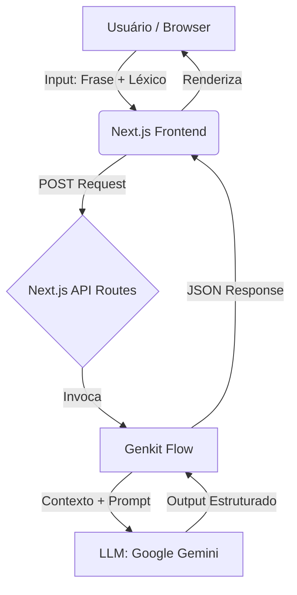

# 🤖 Lógica IA Web

**Lógica IA Web** é um Agente de IA capaz de traduzir sentenças em Linguagem Natural (Português) para fórmulas no Cálculo Proposicional Clássico (CPC), e vice-versa. O projeto visa promover a compreensão dos fundamentos da lógica formal e suas aplicações em IA de forma interativa.

O sistema utiliza o poder das LLMs orquestradas pelo **Firebase Genkit** para preencher a lacuna entre a linguagem humana e a lógica formal.

---

## 🎥 Demonstração

Confira o funcionamento do agente no vídeo abaixo:

[**Assistir Demo do Lógica IA Web**](https://www.loom.com/share/e919881aa6ce493aad38ffe20311ed39)

---

## 🏗️ Arquitetura do Sistema

A aplicação segue uma arquitetura moderna baseada em microsserviços serverless (via Next.js API Routes) e orquestração de IA.

### Fluxo de Dados
1.  **Interface (Client):** O usuário insere a frase ou fórmula e define o léxico (proposições).
2.  **API Layer (Next.js):** Recebe a requisição e valida os dados de entrada (Zod).
3.  **Genkit Flow (Server-side):** O fluxo do Genkit prepara o prompt, injetando o contexto das regras lógicas e o léxico definido pelo usuário.
4.  **LLM (Google Gemini):** O modelo processa a tradução baseada nas instruções estritas de lógica formal.
5.  **Resposta:** O resultado retorna estruturado para o frontend, que renderiza a tradução e explicações.



---

## 🧠 Estratégia de Tradução

Para garantir alta precisão nas traduções entre Linguagem Natural (NL) e Lógica Proposicional (CPC), utilizamos as seguintes estratégias:

### 1. Prompt Engineering Estruturado (System Prompt)
O modelo recebe instruções estritas para atuar como um especialista em lógica matemática.
* **Regra de Ouro:** O modelo é proibido de "alucinar" novas variáveis. Ele deve usar estritamente as proposições (P, Q, R, etc.) definidas pelo usuário no léxico.

### 2. Mapeamento de Conectivos
O sistema instrui a LLM a reconhecer variações linguísticas dos conectivos lógicos:
* **Conjunção ($\land$):** "e", "mas", "contudo", "além disso".
* **Disjunção ($\lor$):** "ou".
* **Condicional ($\to$):** "se... então", "implica", "logo", "portanto".
* **Bicondicional ($\leftrightarrow$):** "se e somente se", "é necessário e suficiente".
* **Negação ($\neg$):** "não", "não é verdade que", "é falso que".

### 3. Uso do Genkit
Utilizamos o Genkit para tipar a saída da LLM (**Output Schema**), garantindo que o JSON retornado contenha campos separados para a `fórmula`, a `explicação` e a `análise sintática`, evitando respostas em texto livre difícil de processar.

---

## 📊 Exemplos de Input/Output e Análise

Abaixo apresentamos casos de teste realizados para validar a eficácia do agente.

### ✅ Caso de Sucesso (Simples)
* **Léxico:** P = Está chovendo, Q = Vou ao cinema.
* **Input (NL):** "Se não estiver chovendo, então vou ao cinema."
* **Output Esperado:** $\neg P \to Q$
* **Resultado do Agente:** $\neg P \to Q$
* **Análise:** O modelo identificou corretamente a estrutura condicional e a negação no antecedente.

### ✅ Caso de Sucesso (Complexo)
* **Léxico:** P = Estudo, Q = Passo na prova, R = Fico feliz.
* **Input (NL):** "Estudar é condição necessária e suficiente para passar na prova e ficar feliz."
* **Resultado do Agente:** $P \leftrightarrow (Q \land R)$
* **Análise:** O modelo compreendeu a precedência dos operadores, agrupando corretamente $(Q \land R)$ sob o bicondicional.

### ⚠️ Limitação/Erro Conhecido (Ambiguidade)
* **Léxico:** P = Como bolo, Q = Como sorvete.
* **Input (NL):** "Eu como bolo ou sorvete."
* **Resultado do Agente:** $P \lor Q$ (Disjunção Inclusiva)
* **Análise:** Em linguagem natural, o "ou" pode ser exclusivo (um ou outro, mas não ambos). O CPC padrão trata "ou" como inclusivo ($\lor$). Sem contexto adicional, o modelo opta pelo padrão inclusivo, o que pode divergir da intenção do usuário caso ele quisesse um "Ou exclusivo" (XOR).

---

## 🚧 Limitações e Possibilidades de Melhoria

Embora o sistema seja robusto, existem limitações inerentes ao uso de LLMs e à complexidade da linguagem natural:

1.  **Ambiguidade Linguística:** Frases como "Ele viu o homem com o telescópio" possuem múltiplas interpretações lógicas dependendo do contexto, o que pode confundir o agente.
2.  **Alucinação de Variáveis:** Em casos raros, se o usuário insere uma frase muito complexa sem definir o léxico apropriado, a LLM pode tentar inferir uma variável (ex: 'S') que não foi explicitamente cadastrada.
3.  **Escopo:** Atualmente restrito à Lógica Proposicional. Não suporta Lógica de Predicados (quantificadores $\forall$, $\exists$).

### Melhorias Futuras
* Implementação de validação cruzada sintática (parser tradicional) para verificar a saída da LLM.
* Expansão para Lógica de Primeira Ordem (Predicados).
* Adição de histórico de conversas para refinar traduções anteriores.

---

## 🛠️ Stack Tecnológica

Este projeto utiliza um conjunto de tecnologias modernas para criar uma experiência fluida e inteligente:

* **Core:** TypeScript
* **Framework Web:** Next.js (App Router)
* **Estilização:** Tailwind CSS & shadcn/ui
* **Animações:** Framer Motion
* **IA & Backend:** Firebase Genkit (para orquestrar os fluxos de IA)

## 🚀 Começando

Siga estas instruções para obter uma cópia local do projeto.

### Pré-requisitos
* Node.js (v18+)
* Chave de API válida (Google AI Studio / Gemini)

### Instalação

1.  **Clone o repositório:**
    ```bash
    git clone [https://github.com/igordmouraa/logical-translator](https://github.com/igordmouraa/logical-translator)
    cd logica-ia-web
    ```

2.  **Instale as dependências:**
    ```bash
    npm install
    ```

3.  **Configure as variáveis de ambiente:**
    Crie um arquivo `.env` na raiz e adicione:
    ```env
    GEMINI_API_KEY='SUA_GEMINI_API_KEY'
    ```

4.  **Rode o servidor:**
    ```bash
    npm run dev
    ```
    Acesse `http://localhost:9002`.

---

## 👤 Autor

Desenvolvido por **Igor de Moura**.
